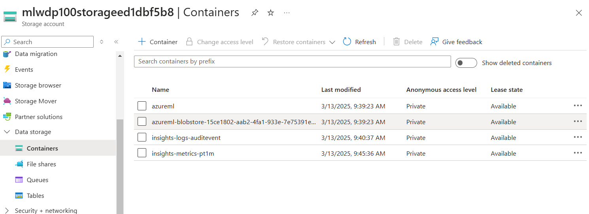
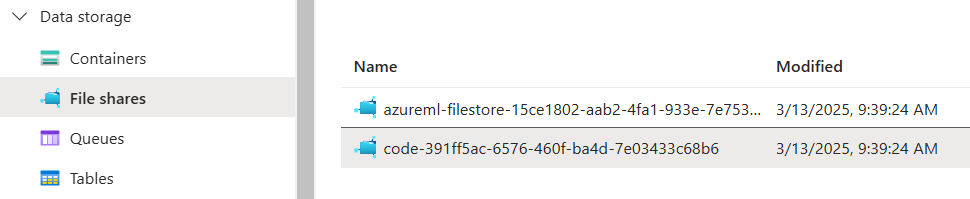

# Making data available

URIs - Uniform Resource Identifiers: Basically the location of the data. 

There is a protocol to connect URIS for Azure Machine Learning.


`http(s):` Use for data stores publicly or privately in an Azure Blob Storage or publicly available http(s) location.

`abfs(s):` Use for data stores in an Azure Data Lake Storage Gen 2.

`azureml:` Use for data stored in a datastore.

## Datastore

This is an abstraction for cloud data sources. They have the info to connect an external data source. This info is usually not in the script of the code.

There are two authentication methods:

 1. **Credential-based** (account key, SAS token) — stored in Azure Key Vault
 2. **Identity-based** (Microsoft Entra ID / Managed Identity) — recommended for production, no secrets to manage

storage -> credential-based / identity-based authentication -> SQL/dataGen2/API

> **DP-100 Note**: Identity-based authentication using managed identities is the recommended approach. Credential-based auth with account keys works but requires storing secrets.

## Type of datastores

 * Azure Blob Storage

 * Azure File Share 

 * Azure Data Lake (Gen 2)

## Datastore for Azure Blob Storage container

There are different ways to create datastores with a graphical UX, Azure command-line interface (CLI), and Python (SDK).

`blob_storage:` Cloud object storage for large amounts of unstructured data. Accessible via the REST API, Azure SDKs, PowerShell, and Azure CLI.

[For more on Blob Storage, click this example](/examples/BlobStorage.md)

**Example of blob storage connection to connect Azure Blob Storage container**

```python
blob_datastore = AzureBlobDatastore(
    			name = "blob_example",
    			description = "Datastore pointing to a blob container",
    			account_name = "mytestblobstore",
    			container_name = "data-container",
    			credentials = AccountKeyConfiguration(
        			account_key="XXXxxxXXXxXXXXxxXXX"
    			),
)
ml_client.create_or_update(blob_datastore)
```

**Note** This is also possible with a SAS Token (SAS: Shared Access Signature — a token-based auth method that grants limited access to storage resources with an expiry time).

> **DP-100 Note**: You can also create datastores using the **CLI v2** with a YAML file:
> ```bash
> az ml datastore create --file datastore.yml
> ```
> Or with **identity-based** auth (no keys needed if the workspace managed identity has Storage Blob Data Reader role):
> ```python
> blob_datastore = AzureBlobDatastore(
>     name="blob_example",
>     account_name="mystestblobstore",
>     container_name="data-container",
>     # No credentials — uses workspace managed identity
> )
> ml_client.create_or_update(blob_datastore)
> ```

## Create a data asset

A data asset is basically a way in that we could access info needed to compute, train model, etc. There are mainly 3 different ways to create a data asset. 

* URI file: Points to a specific file

* URI folder: Points to a specific folder

* MLTable: Points to a folder/file and includes a schema to read as tabular data

Assets are particularly useful when executing machine learning tasks as Azure Machine Learning jobs. Simply think that I can create a data asset as an input/output for a python job in Azure ML.

### Create a URI file data asset

This points to a specific file. Azure ML only stores the path to the file. These are the possible ways to create a URI file path.


**Example to create URI file data asset**

```python
from azure.ai.ml.entities import Data
from azure.ai.ml.constants import AssetTypes

my_path = '<supported-path>'

my_data = Data(
    path=my_path,
    type=AssetTypes.URI_FILE,
    description="<description>",
    name="<name>",
    version="<version>"
)

ml_client.data.create_or_update(my_data)
```

To work with URI data, you first need to import the data. We can read a `input_data` file as it was a URI file data set that points to a csv file as it shows below:

```python
import argparse
import pandas as pd

parser = argparse.ArgumentParser()
parser.add_argument("--input_data", type=str)
args = parser.parse_args()

df = pd.read_csv(args.input_data)
print(df.head(10))
```

### Create a URI folder data asset

It points to a specific folder. Works similar to URI file and also allows the same path syntax

**This is how we create a URI folder**

```python
from azure.ai.ml.entities import Data
from azure.ai.ml.constants import AssetTypes

my_path = '<supported-path>'

my_data = Data(
    path=my_path,
    type=AssetTypes.URI_FOLDER, # here we specify it is a folder
    description="<description>",
    name="<name>",
    version='<version>'
)

ml_client.data.create_or_update(my_data)
```

**NOTE** To properly give the URI folder to an Azure ML job we first import the data and use as shown here:

```python
import argparse
import glob
import pandas as pd

parser = argparse.ArgumentParser()
parser.add_argument("--input_data", type=str)
args = parser.parse_args()

data_path = args.input_data
all_files = glob.glob(data_path + "/*.csv")
df = pd.concat((pd.read_csv(f) for f in all_files), sort=False)
```

This script would be run via console as follows:

```bash
python script.py --input_data "/path/to/folder"
```

### Create a MLTable data asset

MLTable allows to point to tabular data. It is needed to specify a schema to read the data. It is useful when you have a schema that's always changing its form and so on. Due to this, changing every script is not wise. In that case MLTable is used so, we change directly the schema within the MLTable and not the way that the data is read itself. 

> **DP-100 Exam Tip**: AutoML jobs **require** `MLTABLE` data assets. You cannot use `URI_FILE` or `URI_FOLDER` with AutoML. The MLTable file must be in the same directory as the data files. 

To define a schema we include a MLTable file in the same folder as the data we read. This file includes the path the data pointing, how to read it and so on. 

```yml
type: mltable

paths:
  - pattern: ./*.txt
transformations:
  - read_delimited:
      delimiter: ','
      encoding: ascii
      header: all_files_same_headers
```

[Here's a guide to create yml files as MLtable](https://learn.microsoft.com/en-us/azure/machine-learning/reference-yaml-mltable?view=azureml-api-2)


It is possible to create also a MLtable with Python SDK as the following code shows:

```python
from azure.ai.ml.entities import Data
from azure.ai.ml.constants import AssetTypes

my_path = '<path-including-mltable-file>'

my_data = Data(
    path=my_path,
    type=AssetTypes.MLTABLE, # Here is the way to create a MLtable
    description="<description>",
    name="<name>",
    version='<version>'
)

ml_client.data.create_or_update(my_data)
```

And here is an example of implementing a MLTable as a JOB in Azure:

```python
import argparse
import mltable
import pandas

parser = argparse.ArgumentParser()
parser.add_argument("--input_data", type=str)
args = parser.parse_args()

tbl = mltable.load(args.input_data)
df = tbl.to_pandas_dataframe()

print(df.head(10))
```

**NOTE!** Again, this is supposed to be a job and it will run by console. Something like the code below. A common approach is to convert the tabular data to a Pandas data frame. However, you can also convert the data to a Spark data frame if that suits your workload better.

```bash
python script_mltable.py --input_data "/path/to/folder"
```

## Data access modes (DP-100 important!)

When using data assets as job inputs/outputs, you can specify how the data is accessed:

| Mode | Description | Use for |
|---|---|---|
| `ro_mount` | Read-only mount (DEFAULT for inputs) | Most input scenarios |
| `rw_mount` | Read-write mount (DEFAULT for outputs) | Writing results |
| `download` | Download data to compute node | When mount is slow or unavailable |
| `upload` | Upload from compute to storage | Output data |
| `direct` | Pass URI directly, no mount/download | Large datasets, Spark |

```python
from azure.ai.ml import Input
# Specify mode explicitly
training_input = Input(
    type=AssetTypes.URI_FILE, 
    path="azureml:diabetes-csv:1",
    mode="ro_mount"  # default for inputs
)
```

> **DP-100 Exam Tip**: `ro_mount` is the default for inputs, `rw_mount` for outputs. Use `download` if mounting is not supported by the storage type.

## CLI v2 — Create data assets

```bash
az ml data create --file data-asset.yml
```

```yaml
$schema: https://azuremlschemas.azureedge.net/latest/data.schema.json
name: diabetes-csv
version: 1
type: uri_file
path: azureml://datastores/workspaceblobstore/paths/data/diabetes.csv
```

# Lab 

Link to the lab: 
https://microsoftlearning.github.io/mslearn-azure-ml/Instructions/03-Make-data-available.html

**Assets are saved by default in azureml-blobstore-… container.**

<p align="center">
  
</p>

It is possible to create new containers within the data storage. Remember that what we want to do here is to create a storage management system that allows to store data and retrieve it when needed. *To create a container just simply click on +Container button*

**Notebooks and codes are saved in the file share menu in code slider**


