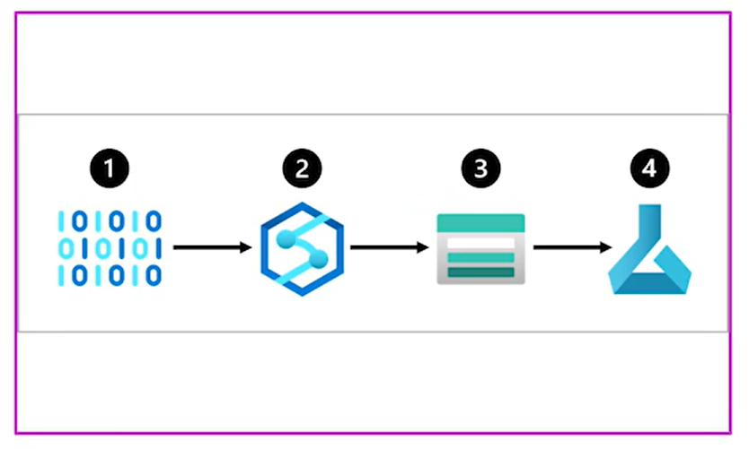

# Understanding the process

To actually create a ML solution in Azure, we need to understand how data is stored. Azure offers 3 types of data storages.

 * Azure Blob Storage: Great and cheapest for unstructured data, files, images, text and json.
 * Azure Data Lake Storage (Gen2): Same as before but with advanced features. Allows to give access to specific file/folder to a specific role-based account
 * Azure SQL Database: Good when we have structured data
  
# Designing a data ingestion solution

Basically, a Pipeline. Now, usually the pipeline involves different services used *outside* of the ML services. This is because, we create the pipeline having in mind the whole process of the data and that could potentially include a heavy transformation in the data. This is where we could use **Azure Synapse System** and **Azure Data bricks** and then put the output in one of the storage systems available to **finally consume it within Azure ML services**

  

``NOTE:`` It would be good to have a background with the other ETLS services. In this case DP-203 certification would be great.

*  **Data Drift** This is when the newer data is statistically different to the old data. This is important because we need to understand whether we train the model with the new data, we add new data or in the worst-case scenario, we retrain the model. But, which case would we do? 

To avoid Data drift, we need to think about the process of ingesting data over the time. The main idea is to train models and this is all part of the process. 

## Other services to keep in mind

# Selecting compute options

Every time a model is trained it is needed to calculate the time that is taking to compute and the resources. Although the process needs trial-and-error checking it is recommended to try from time to time the different configurations of these options to verify that the used one is the best one regarding cost-benefit ratio

## Compute types in Azure ML (DP-100 updated)

| Compute Type | Use Case | Key Info |
|---|---|---|
| **Compute Instance** | Development, notebooks | Single VM, can auto-shutdown to save cost |
| **Compute Cluster** | Training jobs, sweeps, pipelines | Auto-scales from 0 to N nodes, supports low-priority VMs |
| **Serverless Compute** | On-demand training | No infrastructure to manage, pay per job |
| **Kubernetes (AKS)** | Training + inference | Bring your own Kubernetes cluster |
| **Attached compute** | External (Databricks, HDInsight) | Connected from other services |

> **DP-100 Exam Tip**: Set `min_instances=0` on compute clusters to scale to zero when idle (cost savings). Use `tier=low_priority` for cheaper VMs (but they can be preempted). **Serverless compute** is the newest option — no cluster management needed.

**First configuration**
Depending on the needs of the projects, one compute option would be better than another. In general *GPU* will be more expensive than *CPU* although GPU will be faster. The selection in these two options will be critical at the very first stage. 

**Second configuration**

General purpose vs memory optimized. The general purpose computer has a optimal ratio of memory-cpu ratio and it's perfect to develop small analysis. 

On the other hand the memory optimized have a higher memory-to-CPU ratio and it's great for advanced analytics

**Third configuration**

Spark: Apache Spark, a reliable distributed processing framework. Spark allows to distribute the processing into different virtual machines.

# The deployment of a model

After the model is trained, we need to deploy the model into what is called an endpoint. The idea is that the model would be deployed and applications could send the model POST protocols and the model would send the REQUEST answer protocol.

In that order of ideas, an **endpoint** is **simply a location where we'll send the API calls**; now here, what you need to understand is that, if the model is going to be deployed into a real-time endpoint or a batch endpoint.

* Real-Time Endpoint: This is used when the application calls the endpoint and it needs an immediate response from the model. This means that you pay even if the model is not being used. Uses **Managed Online Endpoints** with `instance_type` and `instance_count`.
* Batch Endpoint: This is used when the application calls the model and the responses are stored in the model into batches to be used in time. Batch endpoints will consume processing power when creating the batch and then stop after they finished. Meaning this option is cheaper than real time endpoints. Uses a **compute cluster** for processing.
Batches also allows to process data in parallel and with this you could actually process larger amounts of data more efficiently

As a general rule **if predictions could wait more than 5-10 minutes, batch-endpoints is a better option**

> **DP-100 Exam Tip**: MLflow models deployed to managed online endpoints do NOT need a scoring script or custom environment — Azure ML generates them automatically. Custom models DO need both. For batch endpoints, both MLflow and custom models are supported.

# Designing MLOps Solution

The idea here is to build a solution fast and scalable as fast as we can. What we could do about it? Well, we could actually create 3 environments. Development, pre-production and production environments. This could be having 3 ML workspaces and each one of them is useful for its specific task

## MLOps Maturity Levels (DP-100 relevant)

| Level | Description |
|---|---|
| **0 - No MLOps** | Manual processes, no automation |
| **1 - DevOps (no MLOps)** | CI/CD for app code only, model training still manual |
| **2 - Automated Training** | Automated model training pipelines, manual deployment |
| **3 - Automated Deployment** | Automated training + deployment pipeline (CI/CD for ML) |
| **4 - Full MLOps** | Automated retraining on data drift, monitoring, A/B testing |

> **DP-100 Exam Tip**: Use **Azure DevOps** or **GitHub Actions** to trigger Azure ML pipelines for CI/CD. Use separate workspaces for dev/staging/prod. Models should be registered in one workspace and promoted to production workspace via CI/CD.

## Key MLOps Concepts for DP-100

- **Model monitoring**: Track data drift and model performance degradation in production
- **Pipeline scheduling**: Use `JobSchedule` with `RecurrenceTrigger` to retrain on schedule
- **Blue/green deployment**: Route traffic gradually to new model versions using `endpoint.traffic`
- **Managed identities**: Use system-assigned or user-assigned managed identities for secure resource access without managing credentials

